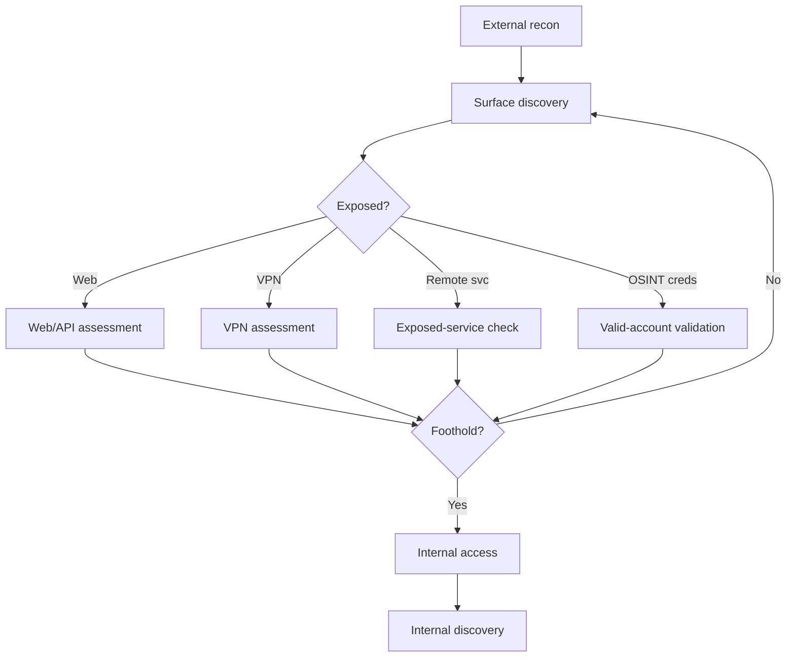
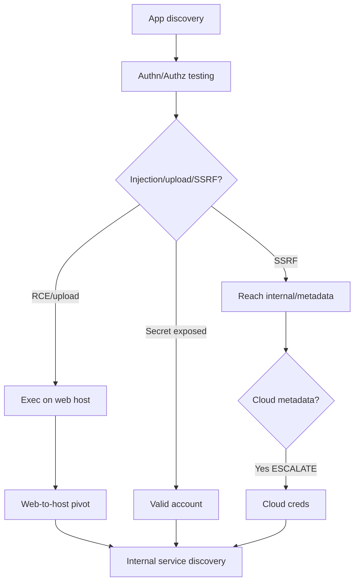
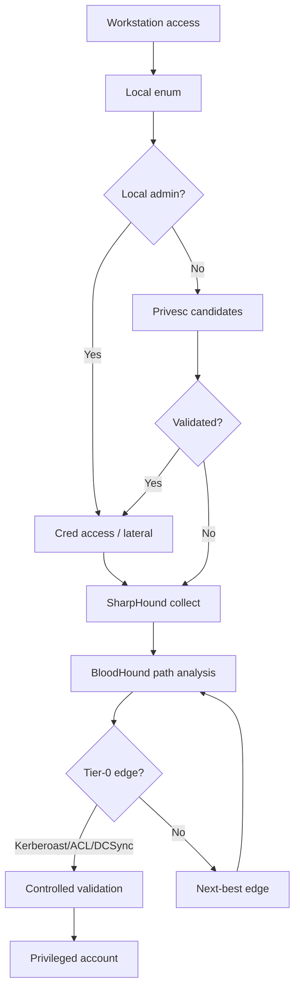
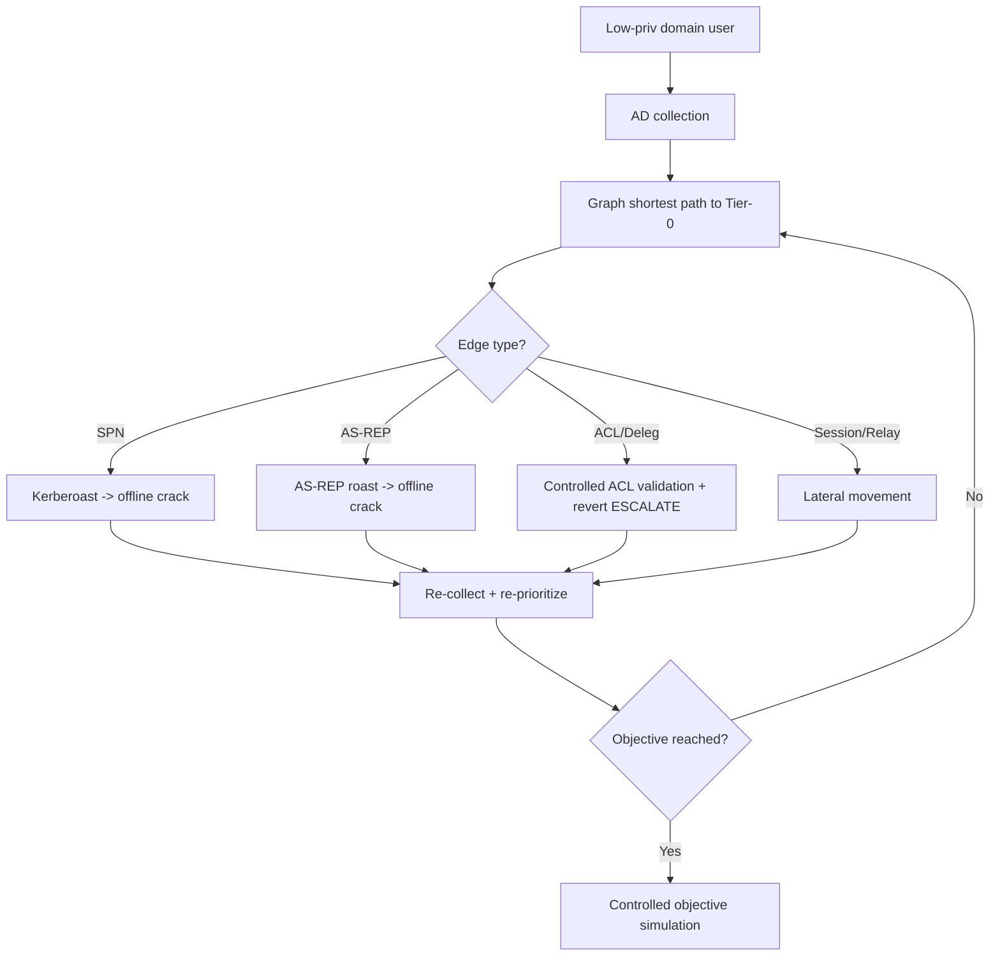
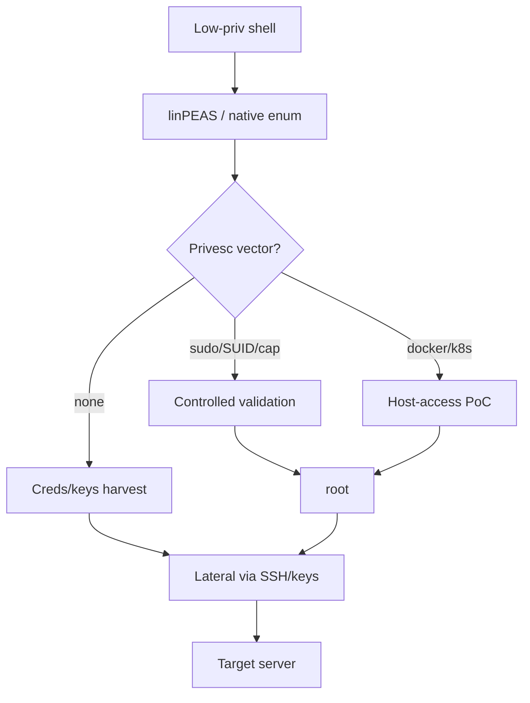
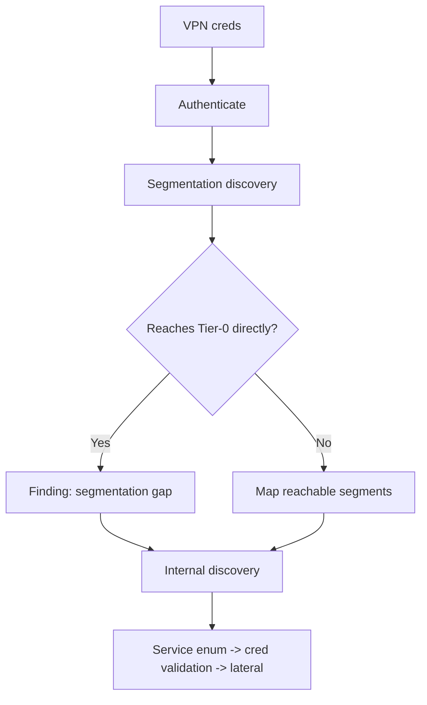
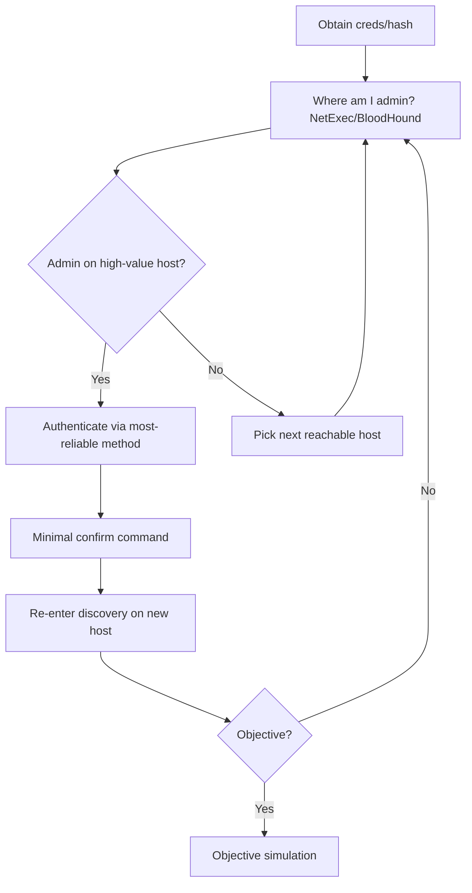
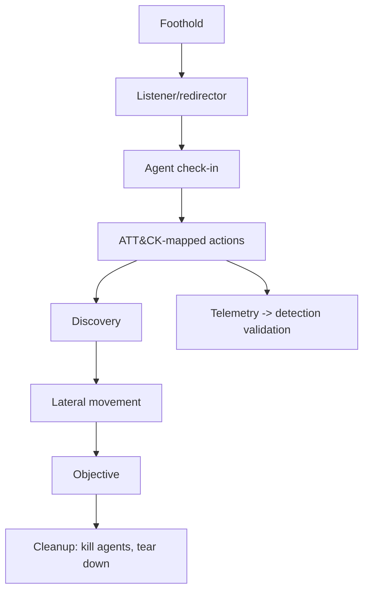
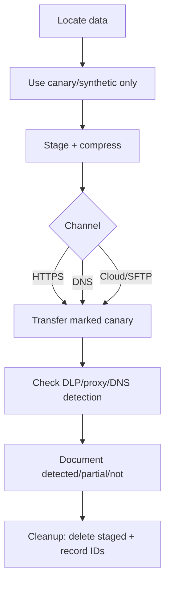
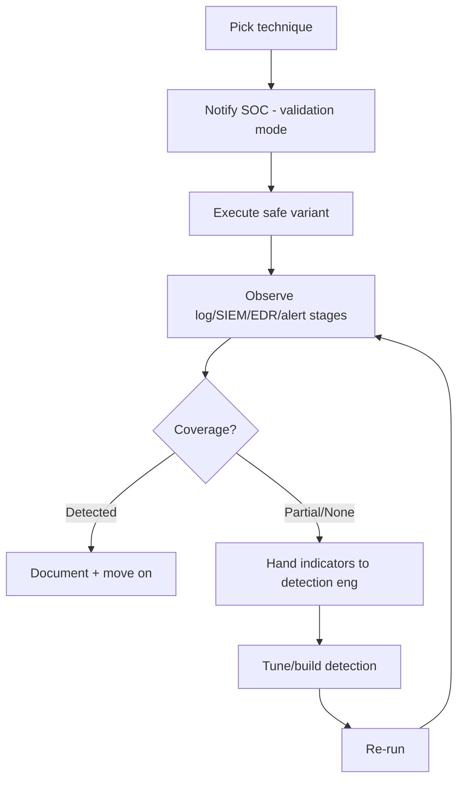

# 20 — Attack Graphs (Mermaid)

Rendered attack graphs for each major path. Each decision node routes per `docs/19`/`docs/27`.

## External attack

## Web-to-internal

## Windows-to-AD

## Low-privilege-to-domain-admin-style path

## Linux-to-server

## VPN-to-internal

## Credential-based lateral movement

## C2 operation

## Data exfiltration simulation

## Purple-team loop

